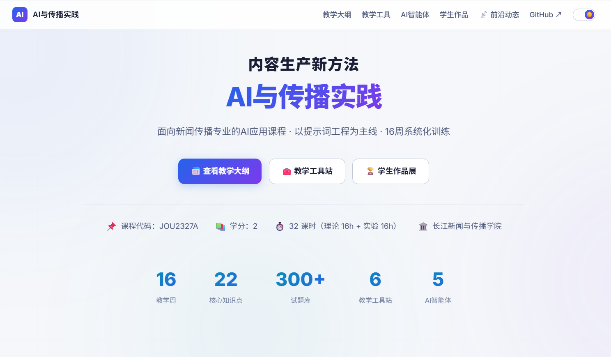
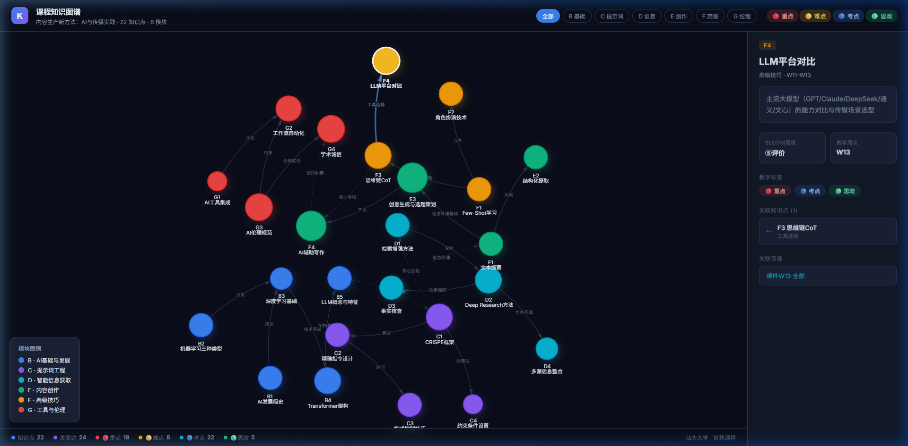
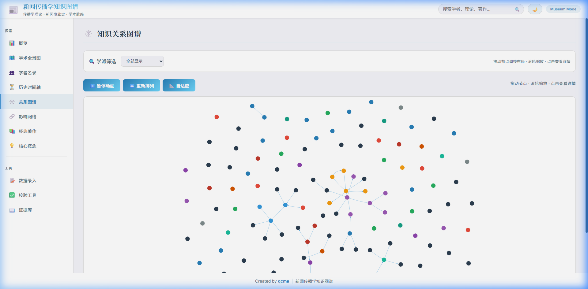
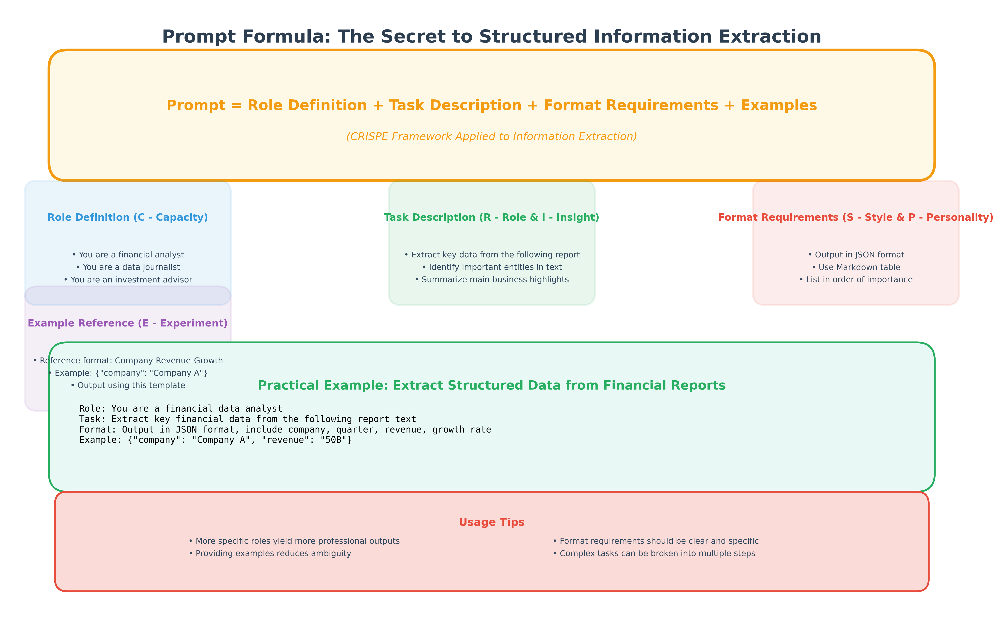
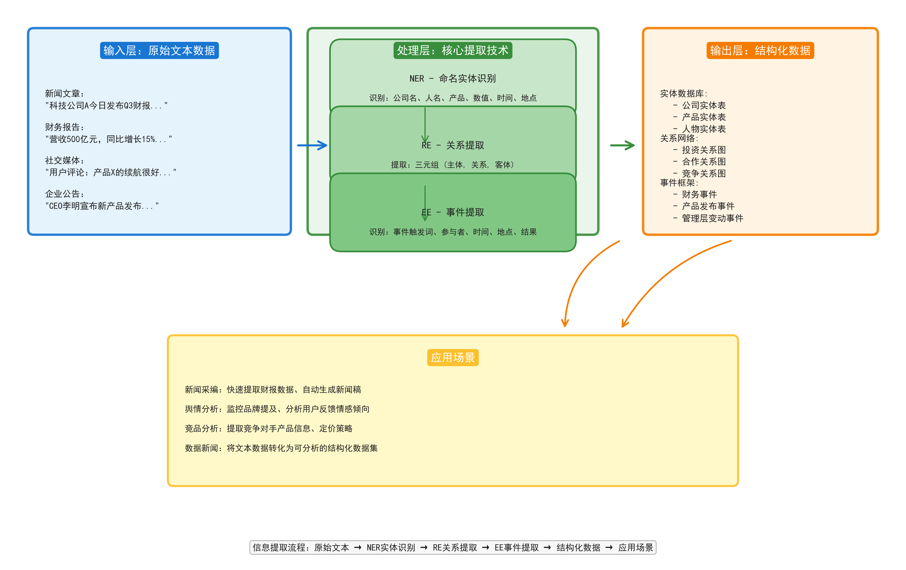
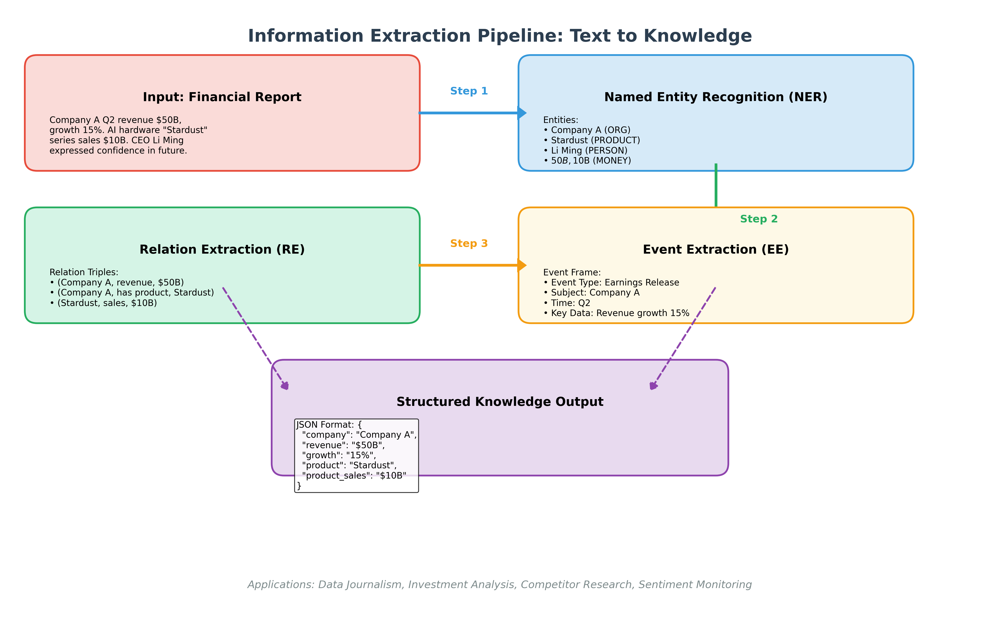

<div align="center">

# 📰 AI驱动的传媒内容制作

### 课程门户 & 智慧学习平台

**16 周系统化训练** · **课程知识图谱** · **AI 趋势追踪** · **伦理思辨**

汕头大学通识课程，从灵感到成稿，重新理解内容生产。

[](LICENSE)
[](https://icgma.github.io/cpnm-ai-comm-practice/)
[](index.html)
[](theme.js)

---

</div>

## ✨ 功能亮点

<table>
<tr>
<td width="50%">

### 📚 16 周课程体系
- 每周独立页面，涵盖从 AI 基础到内容生产的完整路径
- 结构化课程大纲 + OBE 目标矩阵
- 互动式教学案例与实操练习

</td>
<td width="50%">

### 🧠 课程知识图谱
- 可视化课程概念关系网络
- 交互式节点探索，一键跳转相关周次
- 帮助学生建立系统性知识框架

</td>
</tr>
<tr>
<td width="50%">

### 📡 AI 趋势追踪
- 每日更新的 AI 行业动态
- 分类标签 + 时间线浏览
- 聚焦传媒与内容生产领域

</td>
<td width="50%">

### ⚖️ AI 使用伦理规范
- 交互式伦理情境思辨手册
- 学术诚信指导与案例解析
- 培养负责任的 AI 使用意识

</td>
</tr>
</table>

## 🖼️ 系统截图

<table>
<tr>
<td align="center"><b>课程首页</b></td>
<td align="center"><b>课程知识图谱</b></td>
</tr>
<tr>
<td>



</td>
<td>



</td>
</tr>
<tr>
<td align="center"><b>AI 趋势追踪</b></td>
<td align="center"><b>提示词公式</b></td>
</tr>
<tr>
<td>



</td>
<td>



</td>
</tr>
<tr>
<td align="center"><b>信息提取概念</b></td>
<td align="center"><b>信息提取流水线</b></td>
</tr>
<tr>
<td>



</td>
<td>



</td>
</tr>
</table>

## 🏗️ 项目架构

```
cpnm-ai-comm-practice/
├── index.html                # 课程门户首页
├── course-kg/
│   └── index.html            # 课程知识图谱 (交互式)
├── ai-ethics-handbook.html   # AI 伦理规范手册
├── ai-trends.html            # AI 趋势追踪总览
├── obe-matrix.html           # OBE 课程目标矩阵
├── weeks/
│   ├── week-01.html          # 第 1 周：课程导论
│   ├── week-02.html          # 第 2 周：LLM 原理
│   ├── ...
│   └── week-16.html          # 第 16 周：项目展示
├── trends/
│   └── 2026-*.html           # 每日 AI 趋势报告
├── images/                   # 课程配图 & 概念图
├── doc-common.css            # 全局样式
└── theme.js                  # 深色/浅色主题切换
```

## 🚀 快速开始

### 在线访问

直接访问 GitHub Pages 部署的站点：

👉 **[课程门户](https://icgma.github.io/cpnm-ai-comm-practice/)**

### 本地运行

本项目为纯静态 HTML，无需构建工具：

```bash
# 克隆仓库
git clone https://github.com/icgma/cpnm-ai-comm-practice.git
cd cpnm-ai-comm-practice

# 方式一：直接打开
open index.html              # macOS
start index.html             # Windows
xdg-open index.html          # Linux

# 方式二：本地服务器（推荐，支持完整导航）
npx serve .
# 或
python -m http.server 8080
```

## 📋 课程大纲概览

| 周次 | 主题 | 核心内容 |
|:----:|:----:|:--------:|
| 1-2 | AI 基础 | 发展简史、机器学习、深度学习、Transformer |
| 3-4 | 提示词工程 | CRISPE 框架、精确指令、格式控制、约束设置 |
| 5-6 | 智能信息获取 | 检索增强、Deep Research、事实核查、多源整合 |
| 7-8 | 文本处理 | 摘要提炼、结构化提取、信息提取流水线 |
| 9-10 | 创意生成 | 创意方法、选题策划、AI 辅助写作 |
| 11-12 | 高级技巧 | Few-Shot、角色扮演、思维链 CoT、LLM 平台对比 |
| 13-14 | 工具集成 | AI 工具生态、工作流自动化、API 调用 |
| 15-16 | 项目实践 | 期末项目设计、展示与课程总结 |

## 🛠️ 技术特性

| 特性 | 说明 |
|:----:|:----:|
| **纯静态** | 零依赖，HTML + CSS + JS，可直接部署 |
| **响应式** | 移动端 / 平板 / 桌面自适应 |
| **深色/浅色** | 一键切换主题，自动记忆偏好 |
| **知识图谱** | 交互式 D3.js 力导向图 |
| **GitHub Pages** | 零成本部署，自动 HTTPS |

## 🤝 贡献

欢迎 Fork & PR！

1. Fork 本仓库
2. 创建特性分支 (`git checkout -b feature/amazing-feature`)
3. 提交更改 (`git commit -m 'feat: add amazing feature'`)
4. 推送到分支 (`git push origin feature/amazing-feature`)
5. 提交 Pull Request

## 📄 License

[MIT](LICENSE) — 自由使用、修改和分发。

---

<div align="center">

**Made with ❤️ by STU CSS Team**

</div>
