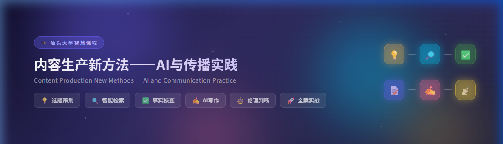

<div align="center">
  <h1>AI驱动的传媒内容制作</h1>
  <p>汕头大学专业课程《AI驱动的传媒内容制作》课程门户源码</p>
  <p>
    <a href="https://jou2327a.aisbest.eu.cc/">
      
    </a>
    
    
    
    
    
  </p>
  <p>
    <a href="https://jou2327a.aisbest.eu.cc/"><strong>在线访问</strong></a>
    ·
    <a href="#快速开始"><strong>快速开始</strong></a>
    ·
    <a href="#维护要点"><strong>维护要点</strong></a>
    ·
    <a href="#部署说明"><strong>部署说明</strong></a>
  </p>
</div>

## 项目简介

这是《AI驱动的传媒内容制作》课程的静态课程门户，用于集中承载课程介绍、16 周教学大纲、AI 工具矩阵、课程知识图谱、伦理规范、OBE 对标材料与期末作品展示。

这个仓库中的 `course-portal/` 目录承担课程官网入口的角色，目标是为学生提供一个统一、稳定、可直接访问的学习入口，而不是依赖复杂后端的内容系统。

## 页面预览

<p align="center">
  
</p>

## 站点内容

| 模块 | 内容 |
| --- | --- |
| 课程首页 | 课程定位、课程特色、核心能力与导航入口 |
| 16 周教学大纲 | `weeks/` 下 16 个周次页面，覆盖从 AI 基础到期末项目 |
| AI 工具与平台 | 课程配套的知识图谱、提示词工程、媒体检索与 AI 编程资源 |
| AI 智能体矩阵 | 导学、提示词、写作、前沿、伦理等伴学入口 |
| 课程文档 | AI 伦理手册、OBE 对标表、专题说明页 |
| 期末作品展示 | 2025-2026 学年学生项目与案例入口 |

## 课程信息

| 项目 | 内容 |
| --- | --- |
| 课程名称 | AI驱动的传媒内容制作 |
| 课程代码 | `JOU2327A` |
| 课程类型 | 专业课程 / AI 应用课程 |
| 学分 | 2 |
| 学习周期 | 16 周 |
| 课程主线 | 提示词工程、智能检索、事实核查、AI 写作、伦理判断、项目实践 |

## 技术栈

| 类型 | 说明 |
| --- | --- |
| 页面结构 | `HTML` |
| 视觉样式 | `CSS` |
| 页面交互 | `Vanilla JavaScript` |
| 部署方式 | `GitHub Pages` + `CNAME` 自定义域名 |

## 快速开始

这个项目是纯静态站点，不依赖打包工具，也不需要安装额外前端框架。

### 方式一：直接打开

直接用浏览器打开 `index.html` 即可预览课程门户。

### 方式二：启动本地静态服务

```bash
python -m http.server 8000
```

然后访问：

```text
http://localhost:8000
```

## 仓库结构

```text
course-portal/
├── course-kg/
│   └── index.html
├── images/
│   ├── course_banner.png
│   └── ...
├── weeks/
│   ├── week-01.html
│   ├── week-02.html
│   ├── ...
│   └── week-16.html
├── ai-ethics-handbook.html
├── AI使用伦理规范_学生手册.md
├── CNAME
├── doc-common.css
├── index.html
├── obe-matrix.html
├── theme.js
├── 课程目标矩阵_OBE对标表.md
└── README.md
```

## 核心文件

| 文件 | 作用 |
| --- | --- |
| `index.html` | 课程门户首页，包含课程介绍、教学大纲、工具矩阵、智能体与作品展示 |
| `weeks/` | 16 个周次子页面，承载详细教学内容 |
| `course-kg/index.html` | 课程知识图谱的交互式可视化页面 |
| `ai-ethics-handbook.html` | 面向学生的 AI 使用伦理规范页面 |
| `obe-matrix.html` | 课程目标与 OBE 对标展示页 |
| `doc-common.css` | 文档型页面通用样式 |
| `theme.js` | 明暗主题切换与页面通用交互逻辑 |
| `CNAME` | GitHub Pages 自定义域名配置 |

## 维护要点

如果后续继续沿用这套课程门户，通常只需要维护以下几类内容：

| 维护任务 | 修改文件 |
| --- | --- |
| 更新课程首页文案、导航、作品入口 | `index.html` |
| 更新各周教学内容 | `weeks/week-*.html` |
| 更新伦理手册、OBE 文档 | `ai-ethics-handbook.html` `obe-matrix.html` 及对应 Markdown 源文件 |
| 调整文档页样式 | `doc-common.css` |
| 调整主题交互 | `theme.js` |
| 更新域名绑定 | `CNAME` |

## 项目特点

- 单页门户 + 多专题页面的结构清晰，适合课程官网长期维护
- 同时覆盖课程说明、周次教学、知识图谱、伦理规范与作品展示
- 面向新闻传播与内容生产场景，课程定位明确，不是泛泛的 AI 工具介绍页
- 不依赖后端即可上线，适合 GitHub Pages 直接部署

## 部署说明

这个目录适合直接部署到 GitHub Pages。

1. 将 `course-portal/` 对应内容推送到发布分支或站点根目录
2. 在 GitHub Pages 设置中选择对应分支和发布目录
3. 保留 `CNAME` 文件以绑定自定义域名
4. 确认线上地址指向 `https://jou2327a.aisbest.eu.cc/`

## 适用场景

- 高校课程门户首页
- AI 专业课程官网
- 多页面教学资源导航站
- 基于 GitHub Pages 的轻量课程网站模板

## 版权说明

本项目内容用于课程教学与教学资源发布。若需复用，请根据具体教学场景自行调整课程名称、院系信息、周次内容、项目案例与链接配置。
